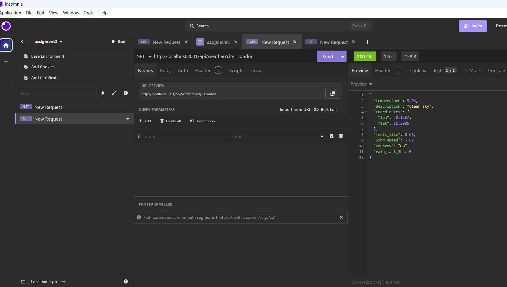
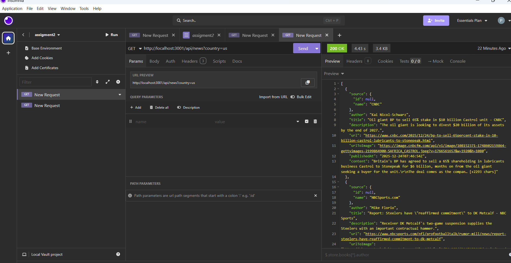

# Weather & News API (Express Backend)

## Project Description

This project is a server-side REST API built with Node.js and Express.
It integrates external APIs and demonstrates how to securely fetch data on the backend and expose it to the frontend.

The application provides:

Weather data for a given city using OpenWeather API

Top news headlines based on the country code using NewsAPI

All API requests are handled only on the backend.
API keys are stored securely in environment variables.

---

## How to Install Dependencies

1. ` git clone https://github.com/Akehdo/web2-assigments/tree/master/assigment2`
2. Open terminal in the project folder
3. In terminal: `npm install`
4. Create a .env file and add your API keys:

   ```
   OPENWEATHER_API_KEY=your_openweather_key
   NEWS_API_KEY=your_newsapi_key
   BINGX_API_KEY=your-bingx-api-key
   BINGX_SECRET_KEY=your-bingx-secret-key
   ```

5. In terminal: ` node server.js`
6. The server will run on: http://localhost:3001

## API Routes

### Weather API

- GET /api/weather - returns current weather data for a given city.

# Example Postman Requests

### Query Parameters:

- city – city name

### GET /api/weather?city=London



### Response:

```
[
  {
    {
	"temperature": 5.04,
	"description": "clear sky",
	"coordinates": {
		"lon": -0.1257,
		"lat": 51.5085
	},
	"feels_like": 0.68,
	"wind_speed": 6.69,
	"country": "GB",
	"rain_last_3h": 0
}
  }
]
```

### News API

- GET /api/news - Returns top news headlines for a given country.

# Example Postman Requests

### Query Parameters:

- country – country code (ISO 3166-1)

### GET /api/news?country=US



### Response:

```
[
   {
     "source": {
	     "id": null,
	     "name": "CNBC"
     },
     "author": "Kai Nicol-Schwarz",
     "title": "Oil giant BP to sell 65% stake in $10 billion Castrol unit - CNBC",
     "description": "The oil giant is looking to divest $20 billion of its assets by the end of 2027.",
     "url": "https://www.cnbc.com/2025/12/24/bp-to-sell-65percent-stake-in-10-billion-castrol-lubricants-to-stonepeak.html",
     "urlToImage": "https://image.cnbcfm.com/api/v1/image/108152371-1748602159864-gettyimages-2199864900-SAFRICA_CASTROL.jpeg?v=1766561657&w=1920&h=1080",
     "publishedAt": "2025-12-24T07:46:54Z",
     "content": "Britain's BP has agreed to sell a 65% shareholding in lubricants business Castrol to Stonepeak for $6 billion, months on from the oil giant seeking a buyer for the unit.\r\nThe deal comes as the compan… [+2293 chars]"
   },
]
```

